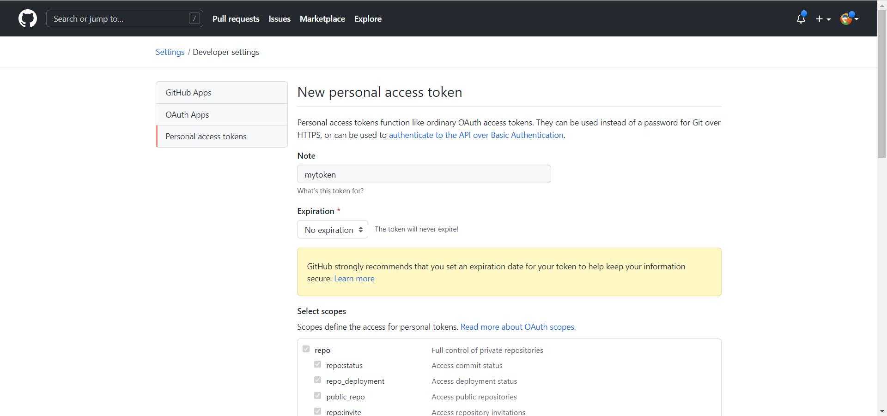
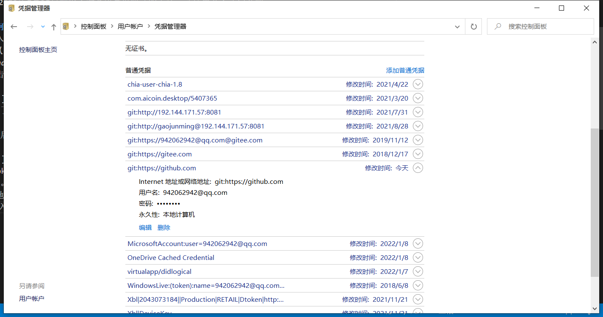

# github个人访问令牌设置
当前版本的git bash使用登录密码推送commit时会失败： 

    $ git push origin master
    Logon failed, use ctrl+c to cancel basic credential prompt.
    Username for 'https://github.com': 942062942@qq.com
    remote: Support for password authentication was removed on August 13, 2021. Please use a personal access token instead.
    remote: Please see https://github.blog/2020-12-15-token-authentication-requirements-for-git-operations/ for more information.
    fatal: Authentication failed for 'https://github.com/gaojunming/gaojunming.github.io.git/'
*失败信息：“2021年8月13日删除了对密码身份验证的支持。请使用个人访问令牌。”*

## 如何解决？
1. 进入**个人设置页面**（*github登录后右上角点击头像选择Settings*）**/开发设置**（*个人设置页面找到Developer settings并点击*）**/个人访问令牌**（*开发设置页面找到Personal access tokens并点击*）
2. 点击`Generate new token`按钮去生成一个新的令牌

    
    为了方便不考虑安全性，我这里设置永不过期，并且全选了访问权限。

    然后点击底部`Generate token`按钮得到生成的token

    
    token此时记得要自己保存一份，否则离开此页面将无法再看到，后面推送认证时还需要用到。
3. 本地git项目下执行`git push origin master`命令去推送修改，弹出认证程序窗口，输入用户名，注意现在密码输入框里要录入刚刚生成的token，而不是普通密码，点击login开始认证。

    成功后windows凭据管理会保留认证信息，这里可以看到刚刚新增的认证凭据，以后再推送时就不会再提示认证了。

    